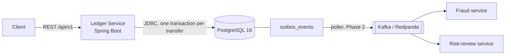

# Ledger Service

[](https://github.com/suvanshchawla/Ledger-Service/actions/workflows/ci.yml)

A double-entry ledger for a small fintech platform. It is the system of record for accounts and money movement: every transfer is booked as an immutable journal entry whose postings sum to zero, writes are idempotent, and every committed transfer is published as an event through a transactional outbox.

This is a portfolio project. Correctness, tests that prove the guarantees, and readability matter more than feature count.

> **Status: early development (Phase 1).** The project skeleton, the `Money` type, the database schema, error handling, the account endpoints and the transfer logic (locking, idempotency, validation, outbox event) exist. The transfer REST endpoints, transaction history and publishing events to Kafka are planned and not built yet. See [Status](#status).

## What it will do

- Open accounts and query their balances (customer and system accounts).
- Move money between two accounts as a single atomic, double-entry transfer.
- Make every write idempotent: retrying a request with the same `Idempotency-Key` never moves money twice, however many times or how concurrently it is sent.
- Keep a per-account transaction history (cursor-paginated, newest first).
- Record an event for every committed transfer in an outbox table, and publish it to Kafka later (at-least-once).
- Report all errors as [RFC 9457](https://www.rfc-editor.org/rfc/rfc9457) Problem Details.

## Guarantees

These are the invariants the test suite is built to prove:

1. For every journal entry, the sum of its postings is 0.
2. For every account, the stored balance equals the sum of its postings.
3. A customer account balance is never negative.
4. One idempotency key produces at most one journal entry.
5. Postings and journal entries are never updated or deleted.

Where possible the database enforces them as well as the application code. For example, customer accounts have a `CHECK` that blocks negative balances, and the append-only tables have triggers that reject `UPDATE` and `DELETE`.

## Architecture



A transfer runs in one database transaction: it locks both accounts with `SELECT ... FOR UPDATE` in ascending id order (so opposing transfers cannot deadlock), checks funds, inserts the journal entry and two postings, updates the cached balances, and writes the outbox row. All of it commits together or not at all. The full flow, data model and reasoning are in the [design doc](docs/design.md).

## Tech stack

Java 21, Spring Boot 3 (Web, Validation, Actuator, JDBC), PostgreSQL 16, Flyway, Gradle (Kotlin DSL), JUnit 5, AssertJ, Testcontainers. The transfer path uses `JdbcClient` with explicit SQL rather than JPA, so every query and lock is visible.

## Getting started

Prerequisites: a JDK 21 or newer, and Docker.

```bash
docker compose up -d     # PostgreSQL 16 on localhost:5432
./gradlew bootRun        # starts the service; Flyway applies migrations on startup
```

Health check: <http://localhost:8080/actuator/health>

Run the tests (they start their own throwaway Postgres with Testcontainers, so Docker must be running):

```bash
./gradlew test
./gradlew test --tests "MoneyTest"   # a single test class
```

If you change a migration that has already been applied to your local database, Flyway will refuse to start. Reset the local database with `docker compose down -v`.

## Project structure

```
src/main/java/dev/suvansh/ledger/
  account/ transfer/ journal/ outbox/ common/    packages by feature
src/main/resources/db/migration/                  Flyway migrations (V<n>__description.sql)
src/test/java/                                    unit and integration tests
docs/                                             design doc and ADRs
docker-compose.yml                                local PostgreSQL
```

## Status

| Area | State |
| --- | --- |
| Gradle project, docker-compose, config | Done |
| `Money` value type (minor units, overflow-safe) | Done |
| Schema (V1-V3): accounts, transfers, journal, postings, outbox, account names, seeded treasury account | Done, with constraint tests |
| Accounts endpoints: open an account (`POST /api/v1/accounts`), fetch one (`GET /api/v1/accounts/{id}`) | Done |
| Account postings history (cursor-paginated) | Planned |
| Transfer service: row locking, idempotency, validation, with concurrency and idempotency tests | Done (service layer) |
| Transfer endpoints (`POST /api/v1/transfers`, `GET /api/v1/transfers/{id}`) | Planned |
| Outbox event written in the transfer transaction (`TransferCommitted`) | Done |
| Problem Details error handling (RFC 9457) | Done |
| Outbox poller and Kafka publishing | Planned (Phase 2) |
| CI: `./gradlew test` on every push (GitHub Actions) | Done |
| ADRs, k6 load-test results | Planned |

Load-test numbers will be added here once the transfer endpoint exists. There are none yet.

## Limitations

- **Not production software.** It is a learning and portfolio project, built to demonstrate correctness techniques.
- **Single currency (CAD).** Accounts carry a currency, but multi-currency and FX conversion are out of scope; a cross-currency transfer will be rejected.
- **No authentication or user management.** At most a static API key later.
- **No real payment rails.** No Interac, card networks or external settlement; money only moves between accounts inside the ledger.
- **No first-class reversals or refunds.** A reversal is a new, compensating transfer.
- **At-least-once event delivery.** Consumers must deduplicate by event id.
- **Single database, single region.** Throughput numbers will be for one instance against one Postgres.
- **No UI.** The REST API is the interface.

## Documentation

- [Design doc and phase plan](docs/design.md)
- Architecture decision records: `docs/adr/` (to be written as decisions are made)
